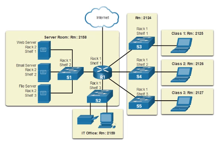
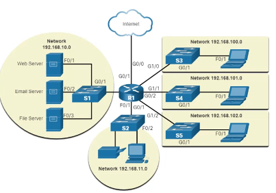

# Module 1: Networking Today <!-- omit in toc -->

[Return to overview](../README.md)

---

- [Topology Diagrams](#topology-diagrams)
- [Common types of networks](#common-types-of-networks)
- [The internet](#the-internet)
  - [Home and small office internet connections](#home-and-small-office-internet-connections)
  - [Businesses Internet Connections](#businesses-internet-connections)
  - [The converging network](#the-converging-network)
- [Network Architecture](#network-architecture)
  - [Fault Tolerance](#fault-tolerance)
  - [Scalability](#scalability)
  - [Quality of Service](#quality-of-service)
  - [Network Security](#network-security)
- [Network Trends](#network-trends)

---

## Topology Diagrams

**Physical topology:** diagrams illustrate the physical location of intermediary devices and cable installation.

**Logical topology:** diagrams illustrate devices, ports, and the addressing scheme of the network.

---

## Common types of networks

Wireless LANN (**WLAN**)
Personal Area Network (**PAN**)
Metropolitan Area Network (**MAN**)

Most important difference between LAN and WAN is usually speed.

---

## The internet

The internet is not owned by any individual or group. The following groups were developed to help maintain structure on the internet.

- Internet Engineering Task Force (IETF)
- Internet Corporation for Assigned Names and Numbers (ICANN)
- Internet Architecture Board (IAB)

**Intranet:** Company only
**Extranet:** Suppliers, Customers, Collaborators
**The Internet:** The world

### Home and small office internet connections

- Cable
- DSL
- Cellular
- Satellite
- Dial-up telephone

### Businesses Internet Connections

- Dedicated leased Line
- Ethernet WAN (orMetro Ethernet)
- DSL
- Satellite (provides connection when wired solution is not available)

### The converging network

Connections now are all done via internet. When it used to be thru coax, RJ33, RJ45 and satellite disk.

---

## Network Architecture

- Fault Tolerance
- Scalability
- Quality of Service (QoS)
- Security

### Fault Tolerance

Limit the impact of a failure. Reliable networks provide redundancy by implementing a **Packet Switched Network**. **Packet switching** splits traffic into packets that are routed over a network,
Each packet could theoretically take a different path to the destination.

This is not possible with **circuit-switched network** (like the former telephone network).

### Scalability

A scalable network can expand quickly and easily to support new users and applications without impacting the performance of services to existing users.

### Quality of Service

With a QoS policy in place, the router can more easily manage the flow of data and voice traffic.

### Network Security

Most of this has already been handled in cyber security. Threat vectors might be external or internal.

Larger networks have additional security requirements:

- Network infrastructure security
  - Physical security of network devices
  - Preventing unauthorized access to the devices
- Information Security
  - Protection of the information or data transmitted over the network

- Dedicated firewall system
- Access control lists (ACL)
- Intrusion prevention systems (IPS)
- Virtual private networks (VPN)

Three goals of network security:

- Confidentiality
- Integrity
- Availability

---
  
## Network Trends

- Bring Your own Device (BYOD)
- Online collaboration
- Video collaboration
- Cloud computing (Made possible by data centers)
  - Public Clouds
  - Private Clouds
  - Hybrid Clouds
  - Custom Clouds
