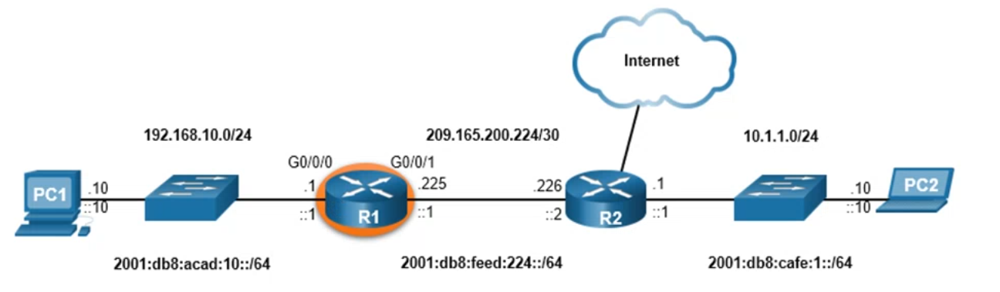
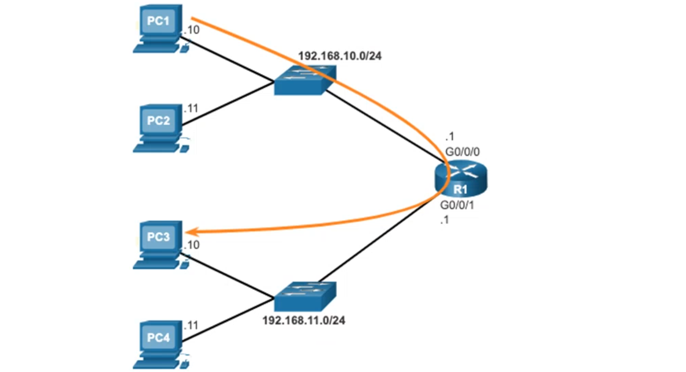

# Module 10: Basic Router Configuration <!-- omit in toc -->

[Return to overview](../README.md)

---

- [Configure Initial Router Settings](#configure-initial-router-settings)
- [Configure Router Interfaces](#configure-router-interfaces)
  - [Verify Interface Configuration](#verify-interface-configuration)
- [Configure the Default Gateway](#configure-the-default-gateway)

---

## Configure Initial Router Settings

**Configure the device name:** `Router(config)# hostname [hostname]`
**Secure privileged EXEC mode:** `Router(config)#  enable secret password`
**Secure user EXEC mode:** 
  `Router(config)# line console 0`
  `Router(config-line)# password [password]`
  `Router(config-line)# login`

**Secure remote Telnet / SSH access** `Router(config)# line vty 0 4`
  `Router(config-line)# password [password]`
  `Router(config-line)# login`
  `Router(config-line)# transport input [ssh || telnet]`

**Encrypt all plaintext passwords:** `Router(config)# service password encryption`
**Provide legal notification and save the confriguration:**
`Router(config)# bannder motd # message #` **||** `Router(config)# bannder motd $ message $`
`Router(config)# end`
`Router# copy running-config startup-config`

---

## Configure Router Interfaces

Configuring one of the router interfaces (G 0/0/1) from the next picture:

```batch
Router(config)# interface gigabitEthernet 0/0/1
Router(config-if)# description [description-text]
Router(config-if)# ip address 209.165.200.225 255.255.255.252
Router(config-if)# ipv6 address 2001:db8:feed:224::1/64
Router(config-if)# no shutdown
```



### Verify Interface Configuration

To verify interface configuration use the `shot ip interface brief` and `show ipv6 interface brief` commands.

Display the contents of the IP routing tables with the `show ip route` and `show ipv6 route` commands.

Display IPv4 statistics for router interfaces with the `show ip interface [type-and-number (gigabitEthernet 0/0/1)]` command. `show ipv6 interface [type-and-number (gigabitEthernet 0/0/1)]`

---

## Configure the Default Gateway

- Used when a host sends a packet to a device on another network.
- Gernerally the router interface address attached to the local network of the host.
- To reach PC3, PC1 addresses a packet with the IPv5 address of PC3, but forwards the packet to its default gateway, the G0/0/0 interface of R1.



- A switch must have a default gateway address configured to remotely manage the switch from another network.
- To configure an IPv4 default gateway on a switch, use the `ip default-gateway [ip-address]` global configuration command.
