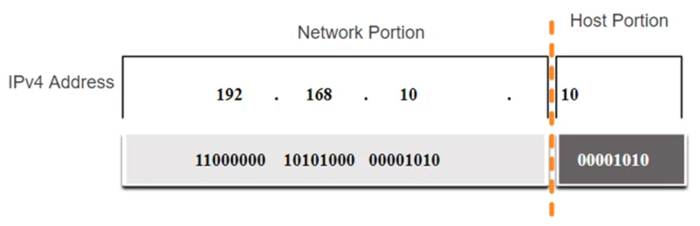
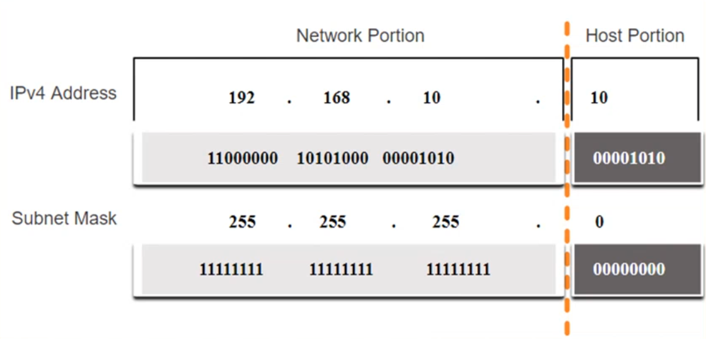
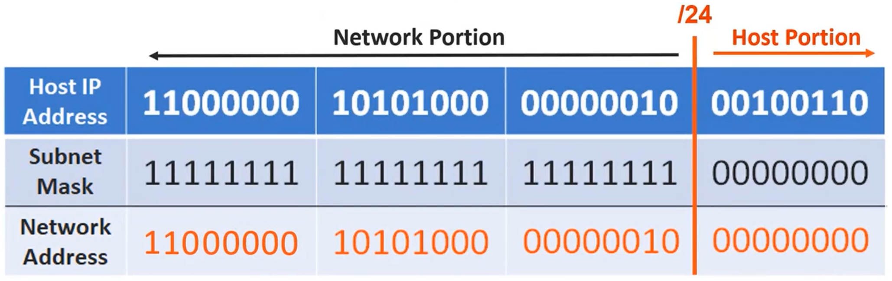
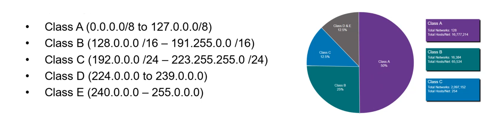
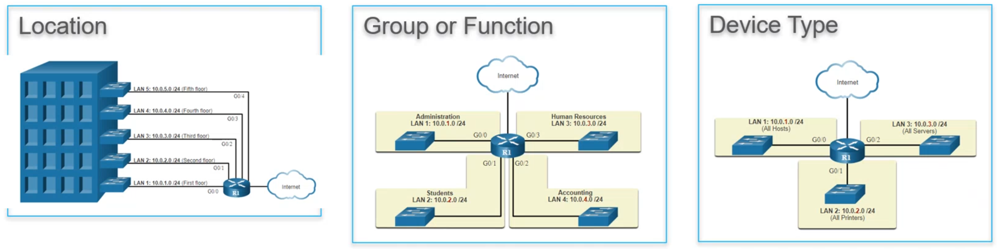
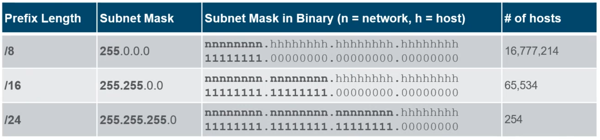
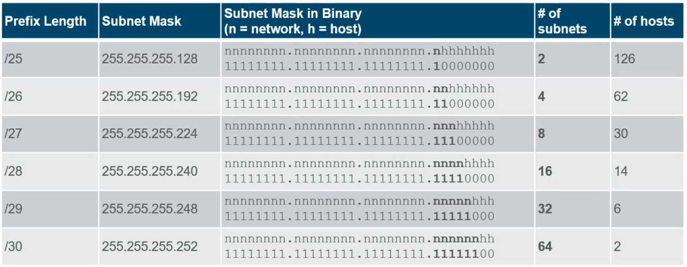
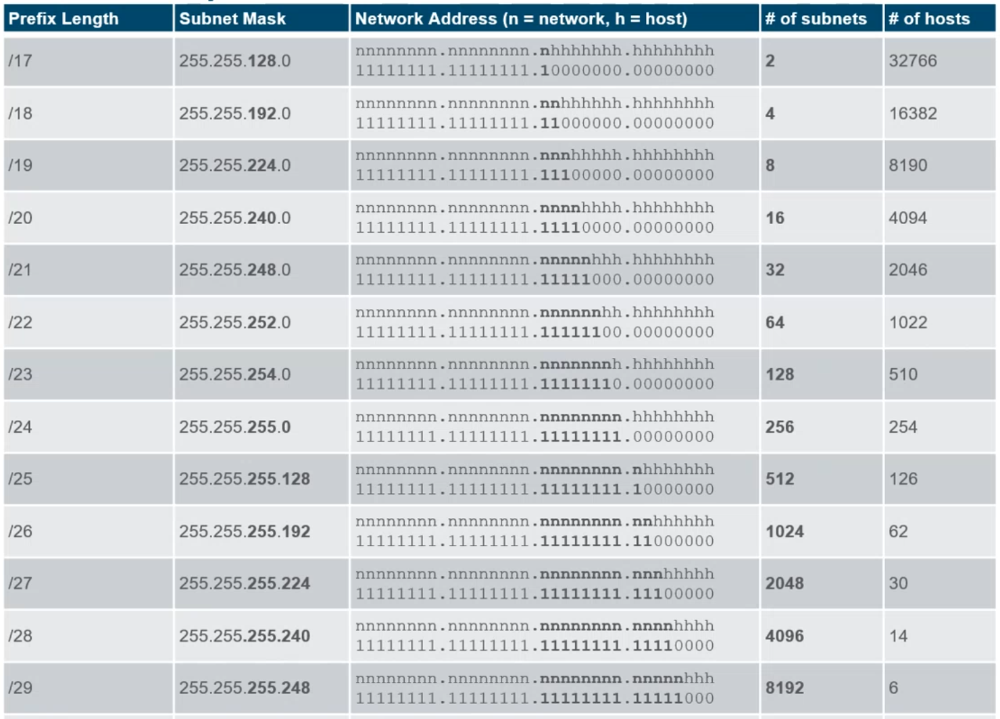

# Module 11: IPv4 Addressing <!-- omit in toc -->

---

- [IPv4 Address Structure](#ipv4-address-structure)
  - [Network and Host Portions](#network-and-host-portions)
  - [The Subnet Mask](#the-subnet-mask)
  - [The Prefix Length](#the-prefix-length)
  - [Determining the Network: Logical AND](#determining-the-network-logical-and)
  - [Determining the Broadcast Address](#determining-the-broadcast-address)
- [IPv4 Unicast, Broadcast and Multicast](#ipv4-unicast-broadcast-and-multicast)
  - [Unicast](#unicast)
  - [Broadcast](#broadcast)
  - [Multicast](#multicast)
- [Types of IPv4 Addresses](#types-of-ipv4-addresses)
  - [Routing to the Internet](#routing-to-the-internet)
  - [Special Use IPv4 Addresses](#special-use-ipv4-addresses)
  - [Legacy Classful Addressing](#legacy-classful-addressing)
- [Network Segmentation](#network-segmentation)
  - [Broadcast Domains and Segmentation](#broadcast-domains-and-segmentation)
  - [Problems with Large Broadcast DOmains](#problems-with-large-broadcast-domains)
  - [Reasons for Segmenting Networks](#reasons-for-segmenting-networks)
- [Subnet an IPv4 Network](#subnet-an-ipv4-network)
  - [Subnet on an Octet Boudary](#subnet-on-an-octet-boudary)
  - [Subnet within an Octet Boundary](#subnet-within-an-octet-boundary)
- [Subnet a Slash 16 and a Slash 8 Prefix](#subnet-a-slash-16-and-a-slash-8-prefix)
- [Subnet to Meet Requirements](#subnet-to-meet-requirements)
  - [Subnet Private versus Public IPv4 Address Space](#subnet-private-versus-public-ipv4-address-space)
  - [Minimize Unused HOst IPv4 Addresses and Maximize SUbnets](#minimize-unused-host-ipv4-addresses-and-maximize-subnets)
- [VLSM](#vlsm)

---

## IPv4 Address Structure

<u>Describe the structure of an IPv4 address including the network portion, the host portion and the subnet mask.</u>

### Network and Host Portions

- An IPv4 address is a 32-bit hierarchical address that is made up of a network portion and a host portion.
- When determining the network portion versus the host portion, you must look at the 32-bit stream.
- A subnet mask is used to determine the network and host portions.

### The Subnet Mask

- To identify the network and host portions of an IPv4 address, the subnet mask is compared to the IPv4 address bit for bit, from left to right.
- The actual process used to identify the network and host portions is called ANDing.

### The Prefix Length

- A prefix length is a less cumbersome method used to identify a subnet mask address.
- The prefix lento is the number of bits set to 1 in the subnet mask.
- It is written in "slash notation" therefore, count the number of bits in the subnet mask and prepend it with a slash.

| Subnet mask | 32-bit Address | Prefix Length |
| --- | :---: | :---: |
| 255.0.0.0         | 11111111.00000000.00000000.00000000 | /8  |
| 255.255.0.0       | 11111111.11111111.00000000.00000000 | /16 |
| 255.255.255.0     | 11111111.11111111.11111111.00000000 | /24 |
| 255.255.255.128   | 11111111.11111111.11111111.10000000 | /25 |
| 255.255.255.192   | 11111111.11111111.11111111.11000000 | /26 |
| 255.255.255.224   | 11111111.11111111.11111111.11100000 | /27 |
| 255.255.255.240   | 11111111.11111111.11111111.11110000 | /28 |
| 255.255.255.248   | 11111111.11111111.11111111.11111000 | /29 |
| 255.255.255.252   | 11111111.11111111.11111111.11111100 | /30 |

The 255.255.255.0 Subnet mask is usually used in a normal network, it has a Prefix Length of 24.
This means the **Network Portion** is 24 bits long, and the **Host Portion** is 8 bits long.

The total amount of host that can be allocated will inside a network will be:

$$
    totalPossibleHost = (32 - prefixLength)^2 - 2
$$

** - 2 because the network address (the first) and the broadcast address (the last) are reserved.

### Determining the Network: Logical AND

- A logical AND Boolean operation is ued in determining the network address. This means:

$$
    IPv4HostAddress * SubnetMask = IPv4 networkAddress
$$

- A device needs to know what network it belongs to in order to forward data correctly.
- Using their **host IP address**, their **subnet mask**, and a process called **binary ANDing**, a device can find the network that it belongs to.
- To do this, devices compare their host IP and their subnet mask bit-for-bit (with the and gate).

### Determining the Broadcast Address

- The broadcast address is used to send a message to all  devices on the network at once.

To determine the Broadcast Address:

- Keep the network portion the same
- Place all binary 1s in the host portion.

$$
11000000.10101000.00000010.00000000 = 11000000.10101000.00000010.11111111 = 192.168.2.255
$$

First usable host `11000000.10101000.00000010.0000001 = 192.168.2.1` (.0 is reserved for Network Address)
Last usable host `11000000.10101000.00000010.11111110 = 192.168.2.254` (.255 is reserved for the Host Portion)

---

## IPv4 Unicast, Broadcast and Multicast

<u>Compare the characteristics and uses of the unicast, boradcast and multicast IPv4 addresses.</u>

### Unicast

Unicast transmission is sending a packet to one destination IP address. Source address is the hosts' IP address and the destination address is the targeted hosts' IP address.

### Broadcast

Broadcast transmission is sending a packet to all other destination IP address, the source address is still the IP from the host, but the destination address is the broadcast address of the network (ends with .255).

### Multicast

Multicast transmission is sending a packet to a multicast address group. It is recognised by the destination address; because this address will be part of the **multicast group** this means it begins with **224** (example: *244.10.10.4.*).
For a host to receive a multicast, it has to be part of that multicast group.

---

## Types of IPv4 Addresses

<u>Explain public, private and reserved IPv4 addresses.</u>

- As defined in RFC 1918, public IPv4  addresses are globally routed between internet service provider (ISP) routers.
- Private addresses are common blocks of addresses used by most organizations to assign IPv4 addresses to internal hosts.
- Private IPv4 addresses are not unique and can be used internally within any network.
- However, private addresses are not globally routable.

**IMPORTANT: Examples of private lan IPv4 addresses**

| Network Address adn Prefix | RFC 1918 Address Range |
| --- | --- |
| 10.0.0.0/8 (huge amounts of hosts) | 10.0.0 - 10.255.255.255 |
| 172.16.0.0/12 | 172.16.0.0 - 172.31.255.255 |
| 192.168.0.0/16 (small amount of hosts) | 192.168.0.0 - 192.168.255.255

### Routing to the Internet

- **Network Address Translation (NAT)** translates private IPv4 addresses to public IPv4 addresses.
- NAT is typically enabled on the edge router connecting to the internet.
- It translates the internal private address to a public global IP address.

### Special Use IPv4 Addresses

**Loopback addresses:**

- Used on a host to test if TCP/IP is operational.
- Commonly identified as only 127.0.0.1
- 127.0.0.0 /8 (127.0.0.1 - 127.255.255.255.254)

**Link-Local addresses**

- Used by Windows DHCP clients to self-configure when no DHCP servers are available.
- Commonly known as the **Automatic Private IP Addressing (APIPA)** addresses or self-assigned addresses.
- 169.254.0.0 /16 (169.254.0.1 - 169.254.255.254)

### Legacy Classful Addressing

RFC 790 (1981) allocated IPv4 addresses in classes
Classful addressing wasted many IPv4 addresses. Classful address allocation was **replaced** with **classless addressing** which ignores the rules of classes (A, B, C)

The Internet Assigned Numbers Authority (IANA) manages and allocates blocks of IPv4 and IPv6 addresses to five Regional Internet Registries (RIRs).
RIRs are responsible for allocating IP addresses to ISPs who provide IPv4 address blocks to smaller ISPs and organizations.

---

## Network Segmentation

<u>Explain how subnetting segments a network to enable better communication.</u>

### Broadcast Domains and Segmentation

Many protocols use broadcasts or multicast (ARP uses broadcasts to locate other devices, hosts send DHCP discover broadcasts to locate a DHCP server)
Switches propagate broadcasts out all interfaces except the interface on which it was received.

- The only device that stops breadcasts is a router.
- Routers do not propagate broadcasts
- Each router interface connects to a broadcast domain and broadcasts are only propagated within that specific broadcast domain.

### Problems with Large Broadcast DOmains

- Hosts can generate excessive broadcasts and negatively affect the network.
- The solution is to reduce the size of the network to create smaller broadcast domains in a process called **subnetting**.
- Dividing the network address 172.16.0.0/16 into two subnets of 200 users each: 172.16.0.0/24 and 172.16.1.0/24
- Broadcasts are only propagated within the smaller broadcast domains.

### Reasons for Segmenting Networks

- Subnetting reduces overall network traffic and improves network performance.
- It can be used to implement security poliies between subnets.
- Subnetting reduces the number of devices affected by abnormal broadcast traffic.
- Subnets are used for a variety of reasons including by: 

---

## Subnet an IPv4 Network

<u>Calculate IPv4 subnets for a /24 prefix</u>

### Subnet on an Octet Boudary

- Networks are most easily subnetted at the octet boundary of /8 /16 and /24.
- Notice that using longer prefix lengths decreases the number of hostts per subnet.

### Subnet within an Octet Boundary

---

## Subnet a Slash 16 and a Slash 8 Prefix

---

## Subnet to Meet Requirements

### Subnet Private versus Public IPv4 Address Space

**Enterprise networks will have an:**

- Intranet - A  company's internal network typically using private IPv4 addresses.
- DMZ - A companies internet facing servers. Devices in teh DMZ (extranet) use public IPv4 addresses.
  
A company could use the 10.0.0/8 and subnet on the /16 or /24 network boundary.
The DMZ devices would have to be configured with public IP addresses.

### Minimize Unused HOst IPv4 Addresses and Maximize SUbnets

There are two considerations when planning subnets:

- The number of host addresses required for each network
- The number of individual subnets needed

---

## VLSM

- Subnets do not have to be equal sizes, as long as their address ranges do not overlap.
- When creating subnets it is easier to work from larger to smaller.
