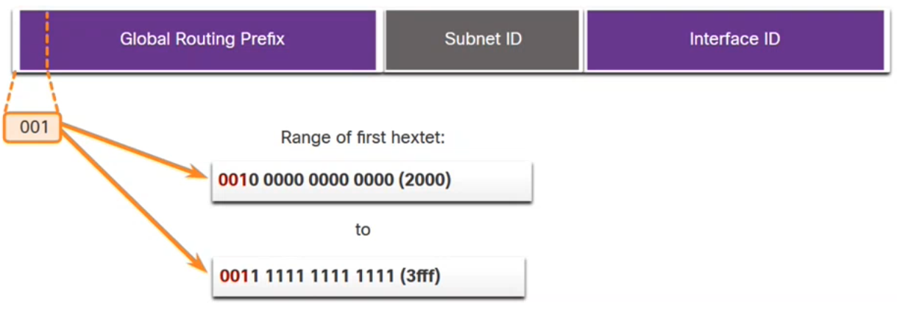
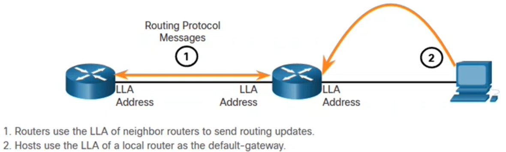
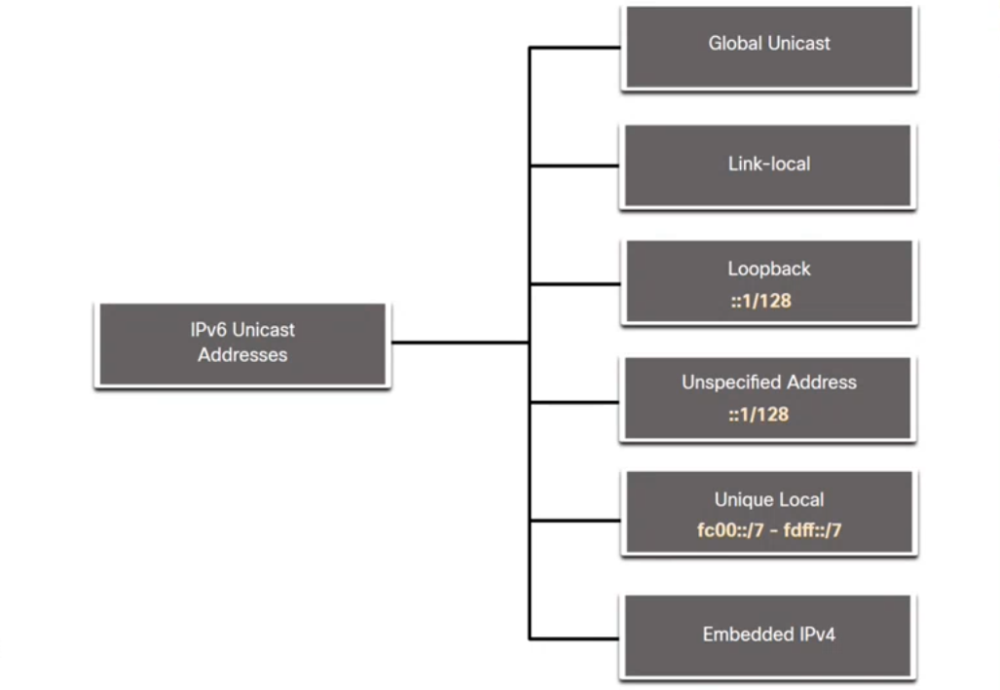
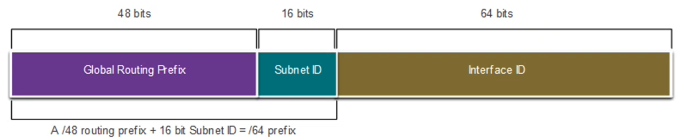

# IPv6 Addressing <!-- omit in toc -->

---

- [IPv4 Issues](#ipv4-issues)
  - [Need for IPv6](#need-for-ipv6)
  - [IPv4 and IPv6 Coexistence](#ipv4-and-ipv6-coexistence)
- [IPv6 Address Representation](#ipv6-address-representation)
  - [IPv6 Addressing Formats](#ipv6-addressing-formats)
- [IPv6 Address Types](#ipv6-address-types)
  - [IPv6 Prefix Length](#ipv6-prefix-length)
  - [Types of IPv6 Unicast Addresses](#types-of-ipv6-unicast-addresses)
  - [Global Unicast Address (GUA)](#global-unicast-address-gua)
  - [Link-local Address (LLA)](#link-local-address-lla)
- [GUA and LLA Static Configuration](#gua-and-lla-static-configuration)
  - [Command for IPv6 GUA on an interface is:](#command-for-ipv6-gua-on-an-interface-is)
  - [Command for IPv6 LLA on an interface is:](#command-for-ipv6-lla-on-an-interface-is)
- [Dynamic Addressing for IPv6 GUAs](#dynamic-addressing-for-ipv6-guas)
  - [Method 1: SLAAC](#method-1-slaac)
  - [Method 2: SLAAC and Stateless DHCP](#method-2-slaac-and-stateless-dhcp)
  - [Method 3: Stateful DHCPv6](#method-3-stateful-dhcpv6)
  - [EUI-64 Process](#eui-64-process)
  - [IMPORTANT: Duplicate Address Detection (DAD)](#important-duplicate-address-detection-dad)
- [Dynamic Addressing for IPv6 LLAs](#dynamic-addressing-for-ipv6-llas)
- [IPv6 Multicast Addresses](#ipv6-multicast-addresses)
  - [Well-Known IPv6 Multicast Addresses](#well-known-ipv6-multicast-addresses)
- [Subnet an IPv6 Network](#subnet-an-ipv6-network)

---

## IPv4 Issues

### Need for IPv6

- IPv5 is running **out of addresses**. IPv6 is the successor to IPv4. IPv6 has a much larger **128-bit address space**.
- The development of IPv6 also included fixes for IPv4 limitations and other enhancements.
- With an increasing internet population, a **limited IPv5 address space, issues with NAT and the IoT**, the time has come to begin the transition to IPv6.

### IPv4 and IPv6 Coexistence

The IETF (Internet Engineering Task Force) has created various protocols and  tools to help network administrators migrate their networks to IPv6. These migration techniques can be divided into three categories:

- **Dual Stack:** The devices run both IPv4 and IPv6 packet over an IPv4 network.
- **Tunneling:** A method of transporting an IPv6 packet over an IPv4 network. The IPv6 packet is encapsulated inside an IPv4 packet.
- **Translation:** Network Address Translation 64 (NAT64) allows IPv6-enabled devices to communicate with IPv4-enabled devices using a translation technique similar to NAT for IPv4.

---

## IPv6 Address Representation

### IPv6 Addressing Formats

In IPv6, a **hextet** is the unofficial term used to refer to a segment of 16 bits, or 4 hexadecimal values.

**Rule 1 - Omit Leading Zero:** 01ab can be represented as 1ab, 0a00 as a00!

**Rule 2 - Double Colon:** A double colon (**::**) can replace any single, contiguous string of one or more 16-bit hextets consisting of **all zeros**. Double colon can only be used **ONCE**.

---

## IPv6 Address Types

There are three broadcast categories of IPv6 addresses:

- **Unicast:** Unicast uniquely identifies an interface on an IPv6-enabled device.
- **Multicast:** Multicast is used to send a single IPv6 packet to multiple destinations.
- **Anycast:** This is any IPv6 unicast address that can be assigned to multiple devices. A packet sent to an anycast address is routed to the nearest device having that address.

### IPv6 Prefix Length

Because there are so many available addresses, we do not have to be "efficient" with the network part and host part of the IPv6 address.
This is why the default Prefix is /64. Meaning **64 bits for the Prefix** and the remaining **64 bits for the Interface ID**.

### Types of IPv6 Unicast Addresses

Unlike IPv4 devices that have only a single address, IPv6 addresses typically have two unicast addresses:

- Global Unicast Address (**GUA**)
- Link-local Address (**LLA**)

### Global Unicast Address (GUA)

This is similar to a public IPv4 address. These are globally unique and routable on the IPv6 internet.

- Currently, only GUAs with the first three bits of 00



### Link-local Address (LLA)

Required for every IPv6-enabled device and used to communicate with other devices on the same local link. LLAs are not routable and are confined to a single link (subnet).

- Packets with a source or destination LLA cannot be routed.
- Every IPv6-enabled network interface must have an LLA
- If an LLA is not configured mannually on an interface, the device will automatically create one.
- IPv6 LLAs are in teh fe80::/10 range.





---

## GUA and LLA Static Configuration

### Command for IPv6 GUA on an interface is:

```batch
R1(config)# interface gigabitethernet 0/0/0
R1(config-if)# ipv6 address 2001:db8:acad:1::1/64
R1(config-if)# no shutdown
R1(config-if)# exit
```

Manually configuring the IPv6 address on **a host** is similar to configuring an IPv5 address. The GUA or LLA of the router interface can be used as the default gateway. **Best practice is to use the LLA**.
When **DHCPv6 or SLAAC** is used, the LLA of the router will automatically be specified as the default gateway address.

### Command for IPv6 LLA on an interface is:

```batch
R1(config)# interface gigabitethernet 0/0/0
R1(config-if)# ipv6 address fe80::1:1 link-local
R1(config-if)# no shutdown
R1(config-if)# exit
```

---

## Dynamic Addressing for IPv6 GUAs

Devices obtain GUA addresses dynamically through **Internet Control Message Protocol version 6 (ICMPv6)** messages. Some examples:

- **SLAAC**
- **Stateful DHCPv6 (no SLAAC)**

### Method 1: SLAAC

- SLAAC allows a device to configure a GUA without the services of DHCPv6.
- Devices obtain the necessary information to configure a GUA from the ICMPv6 RA messages of  the local router.
- The prefix is provided by the RA and the device uses either the EUI-64 or random generation method to create an interface ID.

### Method 2: SLAAC and Stateless DHCP

An RA can instruct a device to use both SLAAC and stateless DHCPv6.
The RA message suggests devices use the following:

- SLAAC to create its own IPv6 GUA
- Th router LLA, which is RA source IPv6 address, as the default gateway address
- A stateless DHCPv6 server to obtain other information such as a DNS server address and a domain name

### Method 3: Stateful DHCPv6

- The router LLA, which is th RA source IPv6 address, for the default gateway address.
- A stateful DHCPv6 server to obtain a GUA, DNS server address, domain name and other necessary information.

### EUI-64 Process

The IEEE defined the Extended Unique Identifier (EUI) or modified EUI-64 process which performs the following:

- A 16 bit value of ffe (in hexadecimal) is inserted into the middle of the 48-bit Ethernet Mac address of the client
- The 7th bit of the client MAC address is reversed from binary 0 to 1.

Example:

| 48-bit MAC | fc:99:47:75:ce:e0 |
| --- | --- |
| **EUI-64 Interface ID:** | f**e**:99:47:**ff:fe**:75:ee:e0 |

This is the difference between an Interface ID that was randomly generated or taken from the MAC address! The difference is the **ff:fe**.

### IMPORTANT: Duplicate Address Detection (DAD)

The client may use a process known as DAD. This is similar to an ARP request. If there is no reply, then the address is unique.

---

## Dynamic Addressing for IPv6 LLAs

Same as GUA, but with LLA the address starts with **fe80**

---

## IPv6 Multicast Addresses

### Well-Known IPv6 Multicast Addresses

Well-known IPv6 multicast addresses are assigned and are reserved for predefined groups of devices.
There are two common IPv6 Assigned multicast groups:

- **ff02::1 All-nodes multicast group:** This is a multicast group that all IPv6-enabled devices join. A packet sent to this group is received and processed by all IPv6 interfaces on the link or network.
- **ff02::2 All-routers multicast group:** This is a multicast group that all IPv6 routers join. A router becomes a member of this group when it is enabled as a IPv6 router with the **IPv6 unicast0routing** global configuration command. 

---

## Subnet an IPv6 Network

IPv6 was designed with subnetting in mind. This means that there is a **hextet reserved for subnetting**!

- A separate subnet ID field in the IPv6 GUA is used to create subnets.
- The subnet ID filed is the area between the Global Routing Prefix and the interface ID.

This allows for 65 536 /64 subnets. (between 0000 and ffff)


