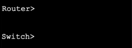
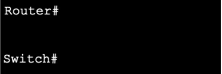

# Module 2: Basic Switch and End Device Configuration <!-- omit in toc -->

[Return to overview](../README.md)

---

- [Cisco IOS Access](#cisco-ios-access)
  - [Access Methods](#access-methods)
  - [Terminal Emulation Programs](#terminal-emulation-programs)
  - [Command Modes](#command-modes)
  - [Configuration Mode and Sub configuration Modes](#configuration-mode-and-sub-configuration-modes)
- [Navigation Between IOS Modes](#navigation-between-ios-modes)
- [The Command Structure and Syntax Check](#the-command-structure-and-syntax-check)
  - [Configure Passwords](#configure-passwords)
- [Securing VTY line access](#securing-vty-line-access)
  - [Encrypt Passwords](#encrypt-passwords)
  - [Message of the day](#message-of-the-day)
  - [Configuration Files](#configuration-files)
- [Cisco Packet tracer](#cisco-packet-tracer)
  - [Building a network](#building-a-network)
- [Ports and Addresses](#ports-and-addresses)
  - [IP Addresses](#ip-addresses)
  - [Manual IP Address Configuration](#manual-ip-address-configuration)

---

## Cisco IOS Access

- Shell
  (User interface that allows the user to request specific tasks from the computer)
- Kernel
  (Communicates between the hardware and software of a computer and manages how hardware resources are used to meet software requirements.)
- Hardware

### Access Methods

- Console
  (A physical management port used to access a device in order to provide maintenance, such as performing the **initial configuration**)
- Secure Shell (SSH)
- ~~Telnet~~

### Terminal Emulation Programs

PuTTY: Terminal emulation program.

### Command Modes

The User EXEC Mode: Identified by the CLI prompt that ends with **>**


The Privileged EXEC Mode: Identified by the CLI prompt that ends with **#**


### Configuration Mode and Sub configuration Modes

Global Configuration Mode: Used to access configuration options on the device. ```Switch(config) #```

Line Configuration Mode: Used to configure console and SSH. ```Switch(config-line) #```

Interface Configuration Mode: Used to configure a switch port or router interface. ```Switch(config-if) #```

---

## Navigation Between IOS Modes

- Privileged EXEC Mode:
  - ```Switch> enable```
  - ```Switch#```
- Global Configuration Mode:
  - ```Switch(config) #exit```
  - ```Switch#```
- Line Configuration Mode:
  - ```Switch(config) #line console 0```
  - ```Switch(config-line) #exit```
  - ```Switch(config)#```

---

## The Command Structure and Syntax Check

### Configure Passwords

```For user EXEC mode: ```
```shell
line console 0
password [password]
login
```

```For privileged EXEC mode:```
```shell
enable secret
```

---

## Securing VTY line access

```bash
line vty 0 15 #Enter lline VTY configuration modein global configuration mode
password [password]
login #Enable VTY access
```

Enter ```line VTY 0 15``` in global configuration. Specify the VTY password using the ```password``` command. And enable VTY access using the login command ```login```.
VTY lines enable remote access using Telnet or SSH to the device. Many Cisco switches support up to 16 VTY lines that are numbered 0 to 15.

### Encrypt Passwords

The startup-config and running-config files display passwords in plaintext.

To encrypt all plaintext passwords, use the ```service password-encryption``` global config command. Then use the ```show running-config``` command to verify that the passwords on the device are now encrypted.

### Message of the day

To create a banner message of the day on a network device, use the ```banner motd # [message here] #``` global config command. The # here is called the delimiting character. It is entered before and after the message.

### Configuration Files

There are two system files that store the device configuration:

**Startup-config:** Is the saved configuration file that is stored in *Non-Volatile RAM (NVRAM)*. It contains all the commands that will be used by the device upon startup or reboot.

**running-config:** Is stored in random *Random Access Memory (RAM)*. It reflects the current configuration. Modifying a running configuration affects the operation of a Cisco device immediately. RAM is volatile memory.

To save changes made to the running configuration to the startup configuration file, use the ```copy running-config startup-config``` privileged EXEC mode command.
If changes to running-config are bad, use ```reload``` to load (and discard changes) from startup-config.

---

## Cisco Packet tracer

### Building a network

Switches are usually connected via copper cross-over cables (dashed line in packet tracer).
End devices are usually connected with fast ethernet cables (full line in packet tracer).

To show current config: ```show running-config```.
Change hostname: ```hostname [name]```

Set password for line console 0:

```bat
S1(config)# line console 0
S1(config-line)# password [password]
S1(config-line)# login
S1(config-line)# exit
```

Set password for user EXEC mode

```bat
S1(config)# enable password [pasword]
S1(config)# exit
```

---

## Ports and Addresses

### IP Addresses

The use of IP addresses is the primary means of enabling devices to locate one another and establish end-to-end communication on the internet.

The structure of an IPv4 address is called **dotted decimal notation** and is represented by four decimal numbers between 0 and 255.

Address 0 is the network address and address 255 is the broadcast address so these cannot be used (they are reserved).

An **IPv4 subnet mask** is a 32-bit value that differentiates the network portion of the address from the host portion. Coupled with the IPv4 address, the subnet mask determines to which subnet the device is a member.

The **default gateway address** is the IP address of the router that the host will use to access remote networks, including the internet.

**IPv6 addresses** are 128 bits in length and written as a string of hexadecimal values. Every four bits is represented by a single hexadecimal digit; for a total of 32 hexadecimal values. Groups of four hexadecimal digits are separated by a colon ':'. IPv6 addresses are not case-sensitive.

### Manual IP Address Configuration

IPv4 address information can be entered into end devices **manually**, or **automatically** using Dynamic Host Configuration Protocol **(DHCP)**.

To access the switch remotely, an IP address and a subnet mask must be configured on the Switch Virtual Interface (SVI). To configure an SVI on a switch:

```batch
Switch# conf t
Switch(config)# interface vlan 1
Switch(config-if)# ip address 192.168.1.20 255.255.255.0
Switch(config-if)# no shutdown
```

To enable the virtual interface use the ```no shutdown``` command.
