# Module 3: Protocols and Models <!-- omit in toc -->

[Return to overview](../README.md)

---

- [Communications Protocols](#communications-protocols)
  - [Message encoding](#message-encoding)
  - [Message formatting and encapsulation](#message-formatting-and-encapsulation)
  - [Message size](#message-size)
  - [Message timing](#message-timing)
  - [Message delivery options](#message-delivery-options)
- [Protocols](#protocols)
  - [Network Protocol Functions](#network-protocol-functions)
  - [Protocol Interaction](#protocol-interaction)
  - [Network Protocol Suites](#network-protocol-suites)
  - [Evolution of Protocol Suites](#evolution-of-protocol-suites)
  - [TCP/IP Protocol Example](#tcpip-protocol-example)
- [Reference Models](#reference-models)
  - [The benefits of using a layered models](#the-benefits-of-using-a-layered-models)
  - [The OSI Reference Model IMPORTANT](#the-osi-reference-model-important)
  - [The TCP/IP Reference Model](#the-tcpip-reference-model)
- [Data Encapsulation](#data-encapsulation)
  - [Segmenting Messages](#segmenting-messages)
  - [Protocol Data Units (PDU)](#protocol-data-units-pdu)
- [Data Access](#data-access)
  - [Addresses](#addresses)
  - [Layer 3 Logical Address](#layer-3-logical-address)
  - [Devices on the Same Network](#devices-on-the-same-network)
  - [Devices on a Remote Network](#devices-on-a-remote-network)
  - [Data Link Addresses](#data-link-addresses)

---

## Communications Protocols

All communications are governed by protocols. Protocols are the rules that communications will follow.

### Message encoding

**Encoding** is the process of converting information into another acceptable form for transmission.
**Decoding** reverses this process to interpret the information.

### Message formatting and encapsulation

Message formats depend on the type of message and the channel that is used to deliver the message.
The message must use a specific format and or structure.

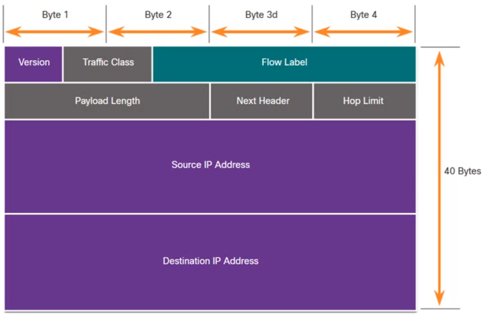

### Message size

When a long message is sent from one host to another over a network, it is necessary to **break the message into smaller pieces**. The rules that govern the size of the pieces, or frames, communicated across the network are very strict. They can also be different, depending on the channel used. **Frames that are too long or too short are not delivered!**

### Message timing

**Flow Control:** Manages the rate of data transmission and defines how much information can be sent and the speed at which it can be delivered.
**Response Timeout:** Manages how long a device waits when it does not hear a reply from the destination.
**Access method:** Determines when someone can send a message.

- There may be various rules governing issues like "collisions". This is when more than one device sends traffic at the same time and the messages become corrupt.
- Some protocols are proactive and attempt to prevent collisions; other protocols are reactive and establish a recovery method after the collision occurs.

### Message delivery options

- **Unicast:** One to one communication
- **Multicast:** One to many, typically not all
- **Broadcast:** one to all
  - The last address of each network is the broadcast address.
  - Broadcasts are used in IPv4 networks, but are not an option for IPv6. (For IPv6 there is  as an additional delivery option)

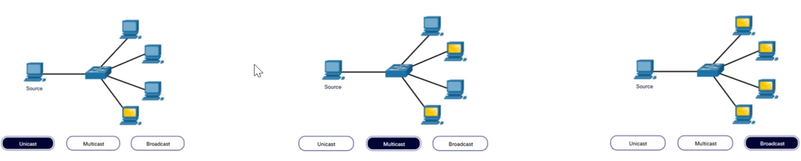

---

## Protocols

Network protocols define a common set of rules. They can be implemented on devices in:

- Software
- Hardware
- Both

Protocols have their own:

- Function
- Format
- Rules

| Protocol Type | Description |
| --- | --- |
| Network communications | Enable two or more devices to communicate over one or more networks |
| ~~Network Security~~ | Secure data to provide authentication, data integrity, and data encryption |
| ~~Routing~~ | Enable routers to exchange route information, compare path information, and select best path |
| ~~Service Discovery~~ | Used for the automatic detection of devices or services |

~~Not in this module~~

### Network Protocol Functions

Devices use agreed-upon protocols to communicate. Protocols may have one or more functions.

- **Addressing:** Identifies sender and receiver
- **Reliability:** Provides guaranteed delivery
- **Flow Control:** Ensures data flows at an efficient rate
- **Sequencing:** Uniquely labels each transmitted segment of data
- **Error Detection:** Determines if data became corrupted during transmission
- **Application Interface:** Process-to-process communications between network applications

### Protocol Interaction

Networks require the use of several protocols. Each protocol has its own function and format.

| Protocol | Function |
| --- | --- |
| **Hypertext Transfer Protocol (HTTP)** |  <ul><li>Governs the way a web server and a web client interact</li><li>Defines content and format</li></ul> |
| **Transmission Control Protocol (TCP)** | <ul><li>Manages the individual conversation</li><li>Provides guaranteed delivery</li><li>Manages flow control </li></ul> |
| **Internet Protocol (IP)** | Delivers messages globally from the sender to the receiver |
| **Ethernet** | Delivers messages from one NIC to another NIC on the same Ethernet Local Area Network (LAN) |

HTTP is always together with TCP!

### Network Protocol Suites

Protocols must be able to work with other protocols.

**Protocol suite:**

- A group of inter-related protocols necessary to perform a communication function.
- Sets of rules that work together to help solve a problem.

The protocols are viewed in terms of layers:

- **Higher Layers**
- **Lower Layers:** Concerned with moving data and provide services to upper layers.

### Evolution of Protocol Suites

There are several protocol suites. **Internet Protocol Suite or TCP/IP** is the most common protocol suite and is maintained by the Internet Engineering Task Force (IETF). (Only TCP/IP will be important in this course ~~ISO, AppleTalk, Novel Netware~~)

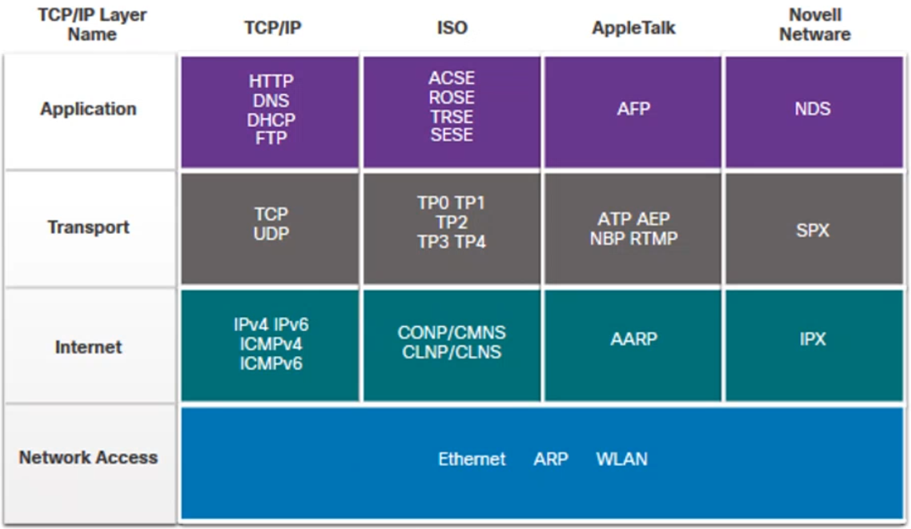

### TCP/IP Protocol Example

TCP/IP protocols operate at the application, transport, and internet layers. The most common network access layer LAN protocols are Ethernet and WLAN (wireless LAN).

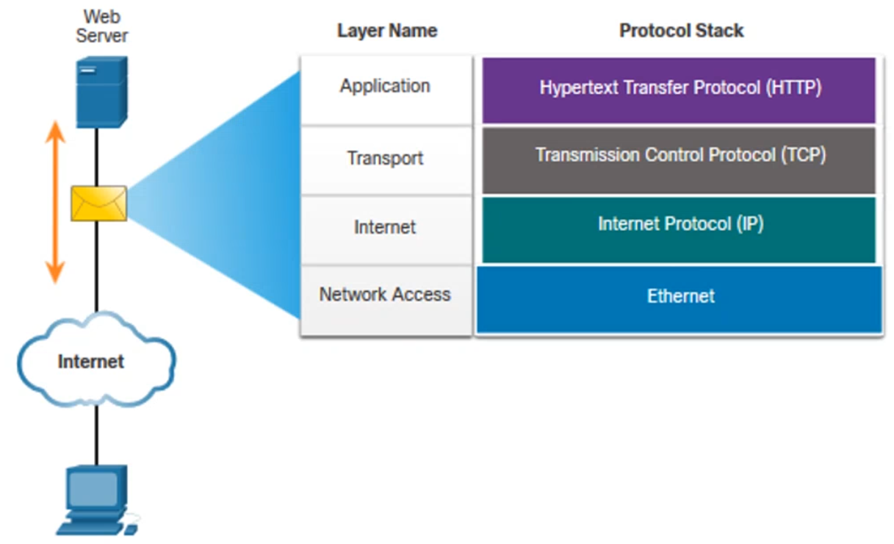

TCP/IP is:

- An open standard protocol suite that is freely available to the public and can be used by any vendor
- A standards-based protocol suite that is endorsed by the networking industry and approved by a standards organization to ensure interoperability.

A web server **encapsulates** and sends a web page to a client.
A client **de-encapsulates** the web page for the web browser.

---

## Reference Models

### The benefits of using a layered models

Complex concepts such as how a network operates can be difficult to explain and understand. For this reason, a layered model is used.

**Two layered models** describe network operations

- Open System Interconnection (OSI) Reference Model
- TCP/IP Reference Model

**The difference between these two models is important:**
The OSI model divides the network access layer and the application layer of the TCP/IP model into multiple layers.
The TCP/IP protocol suite does not specify which protocols to use when transmitting over a physical medium.

OSI Data Link layer and Physical layer discuss the necessary procedures to access the media and the physical means to send data over a network.

| TCP/IP Model | TCP/IP Protocol Suite | **OSI Model** |
| --- | --- | --- |
| Application | *HTTP, DNS, DHCP, FTP* | <ul><li>Application</li><li>Presentation</li><li>Session</li></ul> |
| Transport | *TCP, UDP* | Transport |
| Network | *IPv4, IPv6, ICMPv4, ICMPv6* | Network |
| Network Access | *Ethernet, WLAN, SONET, SDH* | <ul><li>Data Link</li><li>Physical</li></ul> |

Layered models:

- Assist in protocol design because protocols that operate at a specific layer have defined information that *they act upon and a defend interface to the layers above and below*.
- Prevent technology or capability changes in one layer from affection other layers above and below.
- Foster coopetition because *products from different vendors can work together*.
- Provide a common language to describe networking functions and capabilities.

### The OSI Reference Model IMPORTANT

Session, presentation and application are closely related.

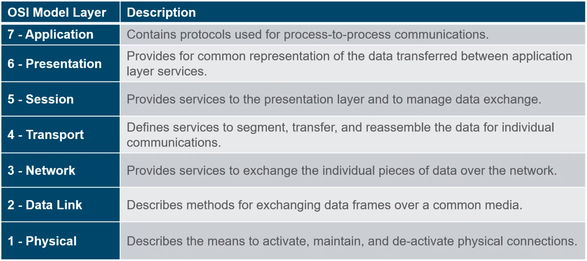

### The TCP/IP Reference Model

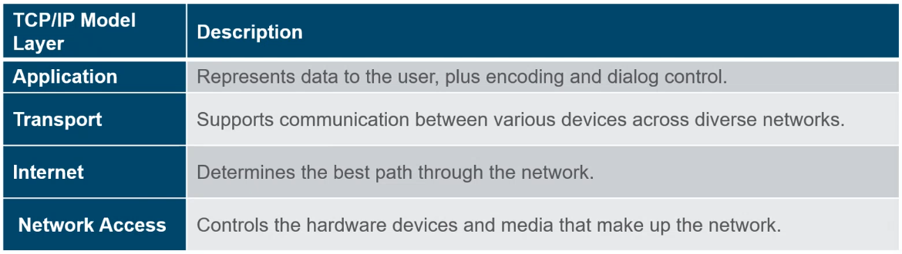

---

## Data Encapsulation

### Segmenting Messages

**Segmenting** is the process of breaking up messages into smaller units.

**Multiplexing** is the process of taking multiple streams of segmented data and interleaving them together.

Segmenting messages has two primary benefits:

- **Increases speed:** Large amounts of data can be sent thru the network without tying up a communication link.
- **Increases efficiency:** Only segments which fail to reach the destination need to be retransmitted, not the entire data stream.

### Protocol Data Units (PDU)

**Encapsulation** is the process where protocols add their information to the data.

- At each stage of the process, a PDU has a different name to reflect its new functions.
- There is no universal naming convention for PDUs, in this course, the PDUs are named according to the protocols of the TCP/IP suite.
- PDUs passing down the stack are as follows:
  - Data (Data Stream)
  - Segment
  - Packet
  - Frame
  - Bits (Bit Stream)

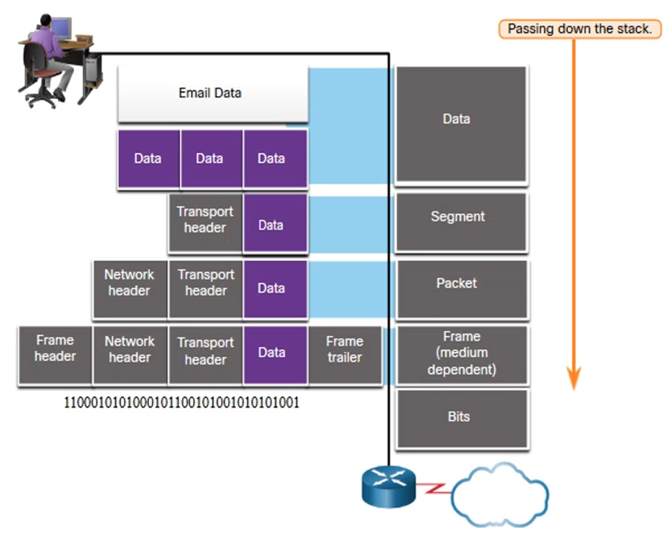

**De-encapsulation:** Data is de-encapsulated as it moves up the stack. When a layer completes its process, that layer strips off its header and passes it up to the next level to be processed.
This is repeated at each layer until it is a data stream that the application can process.

1. Received as Bits (Bit Stream)
2. Frame
3. Packet
4. Segment
5. Data (Data Stream)

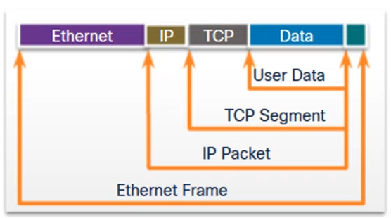

---

## Data Access

### Addresses

Both the data link and network layers use addressing to deliver data from source to destination.

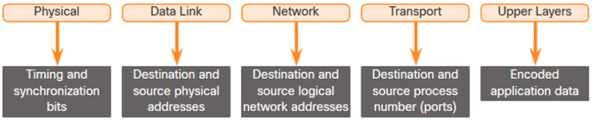

**Network layer source and destination addresses:** Responsibly for delivering the IP packet <u>from origin source to the final destination</u>.
**Data link layer source and destination addresses:** Responsible for delivering the data link frame <u>from one network interface card (NIC) to another NIC on the same network</u>.

### Layer 3 Logical Address

The Ip packet contains two IP addresses. These addresses may be on the same link or remote.

- **Source IP address**
- **Destination IP address**

An IP address contains two parts:

- **Network portion (IPv4) or Prefix (IPv6)**
  - The left-most part of the address indicates the network group from which the IP address is a member.
  - Each LAN or WAN will have the same network portion
- **Host portion (IPv4) or Interface ID (IPv6)**
  - The remaining part of the address identifies a specific device within the group.
  - This portion is unique for each device on the network.

### Devices on the Same Network

When devices are on the same network the source and destination will have the same number in the network portion of the address.

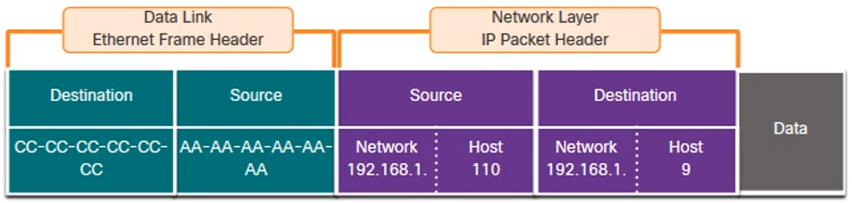

### Devices on a Remote Network

When the final destination is remove, Layer 3 will provide Layer 2 with the local default gateway IP address, also known as the router address.

- The default gateway (DGW) is the router interface IP address that is part of this LAN and will be the "door" or "gateway" to all other remote locations.
- All devices on the LAN must be told about this address or their traffic will be confined to the LAN only.
- Once Layer 2 on PC1 forwards to the default gateway (Router), the router then can start the routing process of getting the information to actual destination.
- The data link addressing is local addressing so it will have a source and a destination for each link.

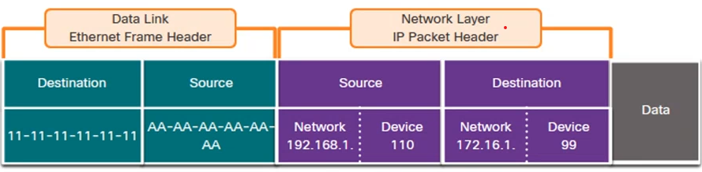

### Data Link Addresses

Since data link addressing is local addressing, it will have a source and destination for each segment or hop of the journey to the destination.

- The MAC addressing for the first segment is:
  - Source - (PC1 NIC) sends frame
  - Destination - (First Router - DGW interface) receives frame

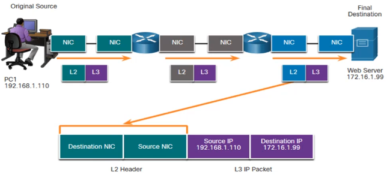
