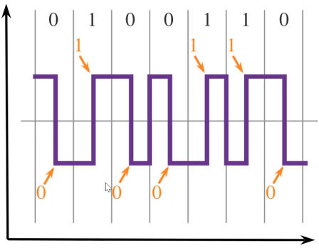
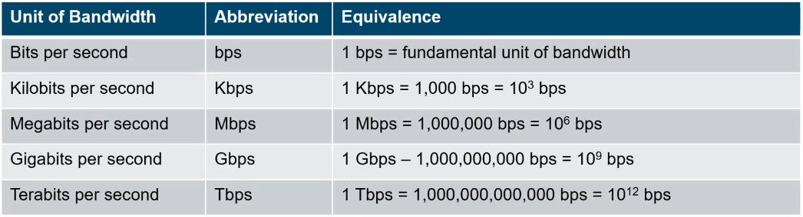
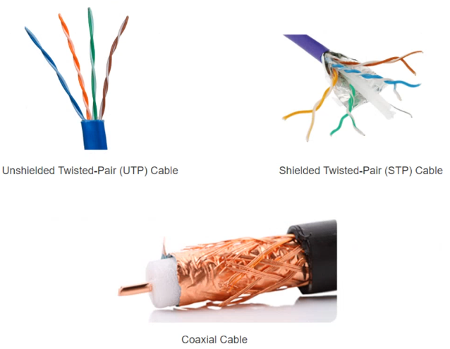
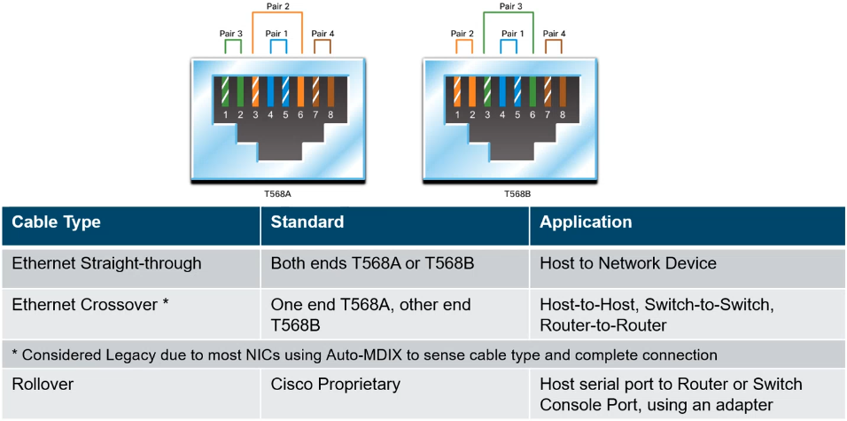
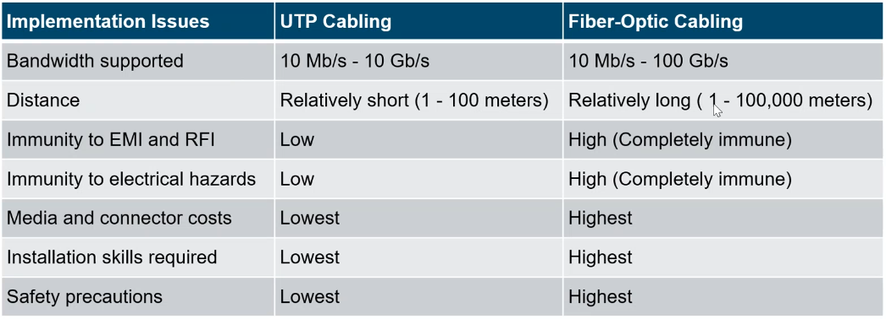

# Module 4: The Physical Layer  <!-- omit in toc -->

[Return to overview](../README.md)

---

- [Purpose of the Physical Layer](#purpose-of-the-physical-layer)
- [Physical Layer Characteristics](#physical-layer-characteristics)
  - [Physical Components](#physical-components)
  - [Encoding](#encoding)
  - [Signaling](#signaling)
  - [Bandwidth](#bandwidth)
- [Copper Cabling](#copper-cabling)
  - [Unshielded Twisted Pair (UTP)](#unshielded-twisted-pair-utp)
  - [Shielded Twisted Pair (STP)](#shielded-twisted-pair-stp)
  - [Coaxial Cable](#coaxial-cable)
- [UTP Cabling](#utp-cabling)
  - [UTP Cabling Standards and Connectors](#utp-cabling-standards-and-connectors)
  - [Straight-through and Crossover UTP Cables](#straight-through-and-crossover-utp-cables)
- [Fiber-Optic Cabling](#fiber-optic-cabling)
  - [Properties of Fiber-Optic Cabling](#properties-of-fiber-optic-cabling)
  - [Types of Fiber Media](#types-of-fiber-media)
  - [Fiber-Optic Cabling Usage](#fiber-optic-cabling-usage)
  - [Fiber versus Copper](#fiber-versus-copper)
- [Wireless Media](#wireless-media)
  - [Properties of Wireless Media](#properties-of-wireless-media)
  - [Types of Wireless Media](#types-of-wireless-media)
  - [Wireless LAN](#wireless-lan)

---

## Purpose of the Physical Layer

<u>Describe the purpose and functions of the physical layer in the network.</u>

**A Network Interface Card (NIC):** connects a device to the network.

- Accepts a complete frame from the Data Link Layer and encodes is as a series of signals that are transmitted to the local media
- This is the last step in the **encapsulation process**
- The next device in the path to the destination receives the bits and re-encapsulates the frame, then decides what to do with it.

---

## Physical Layer Characteristics

<u>Describe characteristics of the physical layer.</u>

**Three functional areas:**

- Physical Components
- Encoding
- Signaling

### Physical Components

The Physical Components are the hardware devices, media and other connectors that transmit the signals that represent the bits. Hardware components like the NICs, interfaces and connectors, cable materials and cable designs are all specified in standards associated with the physical layer.

### Encoding

Encoding converts the stream of bits into a format recognizable by the next device in the network path. Examples of encoding methods include **Manchester** (shown in the figure), 4B/5B, and 8B/10B.

### Signaling

The signaling method is how the bit values, "1" and "0" are represented on the physical medium.

- Electrical Signals over copper cable
- Light Pulses over fiber-optic cable
- Microwave Signals over wireless (AM, FM, PM)
  - with AM there is a lot more noise than with FM.

### Bandwidth

**Latency:** Amount of time, including delays, for data to travel from one given point to another.
**Throughput:** The measure of the transfer of bits across the media over a given period of time.
**Goodput:** The measure of usable data transferred over a given period of time. `Goodput = Throughput - traffic overhead.`

---

## Copper Cabling

<u>Identify the basic characteristics of copper cabling.</u>

Copper cabling is the most common type of cabling used in networks today. It is inexpensive, easy to install, and has low resistance to electrical current flow.

**Limitations:**

- Attenuation - The longer the electrical signals have to travel, the weaker they get.
- The electrical signal is susceptible to interference from sources, which can distort and corrupt the data signals.
  - Electromagnetic Interference (EMI)
  - Radio Frequency Interference (RFI)
  - Crosstalk

**Mitigation:**

- Strict adherence to cable length limits will mitigate attenuation.
- Some kind of copper cable mitigate EMI and RFI by using **metallic shielding and grounding**.
- Some kinds of copper cable mitigate crosstalk by **twisting** opposing circuit pair wires together.

### Unshielded Twisted Pair (UTP)

- UTP is the most common networking media
- Terminated with RJ-45 connectors

**Characteristics of UTP:**

1. The outer jacket protects the copper wires from physical damage
2. Twisted pairs protect the signal from interference.
3. Color-coded plastic insulation electrically isolates the wires from each other and identifies each pair.

### Shielded Twisted Pair (STP)

- better noise protection than UTP
- more expensive than UTP
- harder to install than UTP
- also terminated with RJ-45 connector
- Interconnects host with intermediary network devices

**Characteristics of STP:**

1. The outer jacket protects the copper wires from physical damage
2. Braided or foil shield provides EMI/RFI protection
3. Foil shield for each pair of wires provides EMI/RFI protection
4. Color-coded plastic insulation electrically isolates the wires from each other and identifies each pair

### Coaxial Cable

Commonly used in Wireless installations - attach antennas to wireless devices, cable internet installation (deprecated)

---

## UTP Cabling

<u>Explain how UTP cable is used in Ethernet networks.</u>

UTP has four pairs of color-coded copper wires twisted together and encased in a flexible plastic sheath. No shielding is used. UTP relies on the following properties to **limit crosstalk:**

- **Cancellation** - Each wire in a pair of wires uses opposite polarity. They are twisted together and the magnetic fields effectively cancel each other and outside EMI/RFI.
- **Variation** - Each wire is twisted a different amount (twists / meter), which helps prevent crosstalk.

### UTP Cabling Standards and Connectors

Standards for UTP are established by the TIA/EIA.
**TIA/EIA-568** standardizes elements like:

- Cable Types
- Cable Lengths
- Connectors
- Cable Termination
- Testing Methods

Electrical standards for copper cabling are established by the IEEE, which rates cable according to its **performance**.

- Category 3
- Category 5 and 5e
- Category 6

### Straight-through and Crossover UTP Cables

It is advised to use Crossover between two Routers, Rollover is cisco specific.

---

## Fiber-Optic Cabling

<u>Describe fiber optic cabling and its main advantages over other media.</u>

### Properties of Fiber-Optic Cabling

- High expense (significantly more than Coper Cabling)
- Transmits data over longer distances at higher bandwidth than any other networking media
- Less susceptible to attenuation, and completely **immune to EMI/RFI**
- Mad of flexible, extremely thin stands of very pure glass
- Uses a laser or LED to encode the bits as pulses of light
- The fiber-optic acts as a wave guide to transmit light between the two ends with minimal signal loss

### Types of Fiber Media

**Single-Mode Fiber:**

- Usually yellow
- Very small core
- Uses expensive lasers
- Long-distance applications

**Multimode Fiber:**

- Usually orange
- Larger core
- Uses less expensive LEDs
- LEDs transmit at different angles
- Up to **10 Gbps over (shorter) 550 meters**

**Dispersion** refers to the spreading out of a light pulse over time. Increased dispersion means increased loss of signal strength. MMD has greater dispersion than SMF. This is why the maximum cable distance for MMF is 550 meters and for SMF is 40km.

### Fiber-Optic Cabling Usage

1. **Enterprise Networks** - Used for *backbone* cabling applications and interconnecting infrastructure devices
2. **Fiber-to-the-home (FTTH)**
3. **Long-Haul networks** - USed by service providers to connect countries and cities
4. **Submarine Cable Networks** - Provides reliable high-speed, high-capacity solutions capable of surviving in harsh undersea environments (except that for that Russian sub) at up to transoceanic distances.

### Fiber versus Copper

Optical fiber is primarily used as backbone cabling for high-traffic, point-to-point connections between data distribution facilities and for the interconnection of buildings in multi-building campuses.

---

## Wireless Media

<u>Connect devices using wired and wireless media.</u>

Carries electromagnetic signals using radio or microwave frequencies. Provides the greatest mobility option.

### Properties of Wireless Media

**Limitations:**

- **Coverage area** - Effective coverage can be significantly impacted by the physical characteristics of the deployment location.
- **Interference** - Wireless is susceptible to interference and can be disrupted by many common devices.
- **Security** - Wireless communication coverage requires no access to a physical strand of media, so anyone can gain access to the transmission.
- **Shared medium** - WLANs operate in half0duplex, which means only one device can send or receive at a time. Many users accessing the WLAN simultaneously results in reduced bandwidth for each user.

### Types of Wireless Media

The IEEE and telecommunications industry standards for wireless data communications cover both the data link and physical layers. In each of these standards, physical layer specifications dictate:

**Important Standards (Know THIS):**

- Wi-Fi (**IEEE 802.11**): Wireless LAN (WLAN) technology
- Bluetooth (**IEEE 802.15**): Wireless Personal Area Network (WPAN) standard
- less important WiMax (IEEE 802.16): Uses a point-to-multipoint topology to provide broadband wireless access
- less important Zigbee (IEEE 802.15.4): Low data-rate, low power-consumption communications, primarily for Internet of Things (IoT) applications

### Wireless LAN

**Requirements:**

- Wireless Access Point (AP) - Concentrate wireless signals from users and connect to the existing copper-based network infrastructure
- Wireless NIC Adapters - provide wireless communications capability to network hosts
