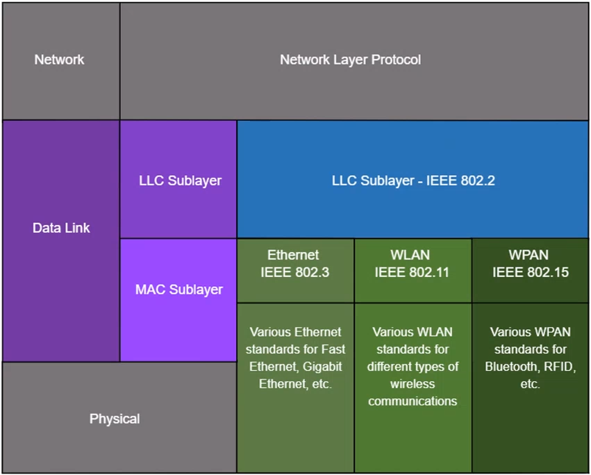
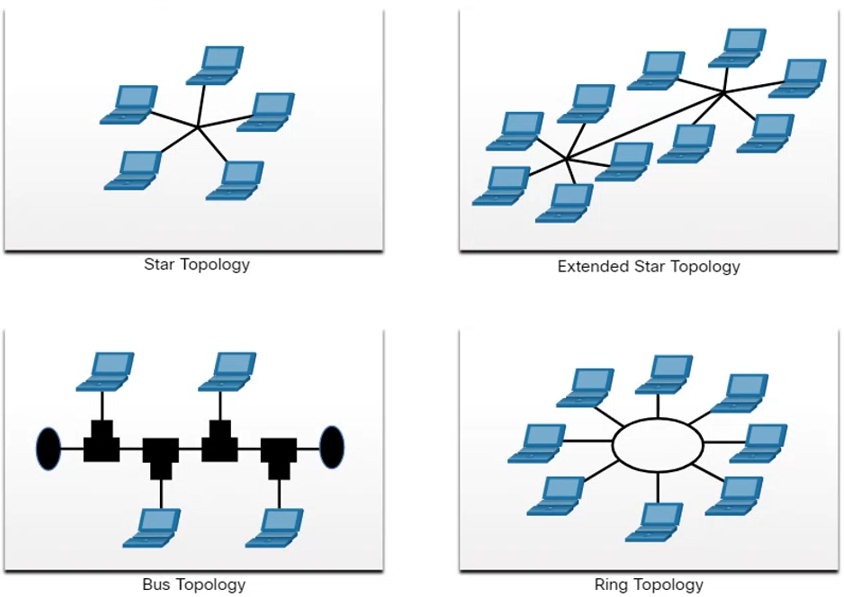
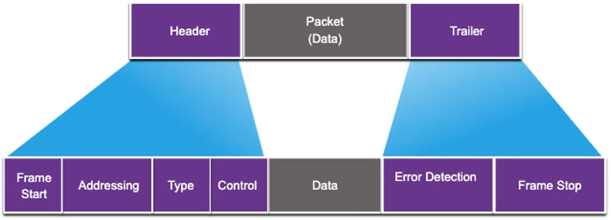

# Module 6: Data Link Layer <!-- omit in toc -->

[Return to overview](../README.md)

---

- [Purpose of the Data Link Layer](#purpose-of-the-data-link-layer)
  - [Providing Access to Media](#providing-access-to-media)
  - [Data Link Layer Standards](#data-link-layer-standards)
- [Topologies](#topologies)
  - [Difference Physical and Logical Topologies](#difference-physical-and-logical-topologies)
  - [WAN Topologies](#wan-topologies)
  - [LAN Topologies](#lan-topologies)
  - [Half and Full Duplex Communication IMPORANT](#half-and-full-duplex-communication-imporant)
  - [Access Control Methods](#access-control-methods)
  - [Contention-Based Access - CSMA/CD](#contention-based-access---csmacd)
  - [Contention-Based Access - CSMA/CA](#contention-based-access---csmaca)
- [Data Link Frame](#data-link-frame)
  - [Layer 2 addresses](#layer-2-addresses)
  - [LAN and WAN frames](#lan-and-wan-frames)

---

## Purpose of the Data Link Layer

<u>Describe the purpose and function of the data link layer in preparing communication for transmission on specific media.</u>

The Data Link layer is responsible for communications between end-device network interface cards. It allows. It allows upper layer protocols to access the physical layer media and encapsulates Layer 3 packets (IPv4 and IPv6) into Layer 2 Frames. It also performs error detection and rejects corrupted frames.

IEEE 802 LAN/MAN standards are specific to the type of network (Ethernet, WLAN, WPAN, etc.)

The Data Link Layer consists of two sublayers.

- **Logical Link Control (LLC):** Communicates between the networking software at the upper layers and the device hardware at the lower layers.
- **Media Access Control (MAC):** Is responsible for data encapsulation and media access control.

### Providing Access to Media

At each hop along the path, a router performs four basic Layer 2 functions:

- **Accepts a frame** from the network medium
- **De-encapsulates** the frame to expose the encapsulated packet
- **Re-encapsulates** the packet into a new frame
- **Forwards** the new frame on the medium of the next network segment

### Data Link Layer Standards

- Institute for Electrical and Electronic Engineers (**IEEE**)
- International Organizations for Standardization (**ISO**)
- International Telecommunications Union (ITU)
- American National Standards Institute (ANSI)

---

## Topologies

<u>Compare the characteristics of media control methods on WAN and LAN topologies.</u>

### Difference Physical and Logical Topologies

There are two types of topologies used when describing networks:

- **Physical topology:** Shows physical connections and how devices are interconnected.
- **Logical topology:** Identifies the virtual connections between devices using device interface and IP addressing schemes.

### WAN Topologies

There are three common physical WAN topologies:

- **Point-to-point:** The simplest and most common WAN topology. Consists of a permanent link between two endpoints.
- **Hub and spoke:** Similar to a star topology (aka LAN topology) where a central site interconnects branch sites through point-to-point links.
- **Mesh:** Provides high availability but requires every end system to be connected to every other end system.

### LAN Topologies

End devices on LANs are typically interconnected using a **star** or **extended star** topology. Star and extended star topologies are easy to install, very scalable and easy to troubleshoot.

Early Ethernet and Legacy Token Ring technologies provide two additional topologies:

- **Bus:** All end systems chained together and terminate on each end. (Vulnerable for interruption, one disconnect means topology offline)
- **Ring:** Each end system is connected to its respective neighbors to form a ring.

### Half and Full Duplex Communication IMPORANT

Mixing half- and full-duplex communications with each other will cause issues. This gives **duplex mismatch**. But modern switches, pcs and servers are full-duplex. Only WLANs can be half-duplex.

**Half-duplex communication:**

- Only allows one device to send or receive at a time on a shared medium.
- Used on WLANs and legacy bus topologies with Ethernet hubs.

**Full-duplex communication:**

- Allows both devices to simultaneously transmit and receive on a shared medium.
- Ethernet switches operate in full-duplex mode.

### Access Control Methods

**Contention-based access:**
All nodes operation in half-duplex, competing for use of the medium. Examples are:

- Carrier sense multiple access with collision detection (CSMA/CD) as used on legacy bus-topology Ethernet.
- Carrier sense multiple access with collision avoidance (CSMA/CA) as used on Wireless LANs.

**Controlled access:**

- Deterministic access where each node has its own time on the medium.
- Used on legacy networks such as Token Ring and ARCNET.

### Contention-Based Access - CSMA/CD

**CSMA/CD:**

- Used by legacy Ethernet LANs
- Operates in half-duplex mode where only on device sends or receives at a time.
- Uses a collision detection process to govern when a device can send and what happens if multiple devices send at the same time.

**CSMA/CD collision detection process:**

- Devices transmitting simultaneously will result in a signal collision on the shared media.
- Devices detect the collision.
- Devices wait a random period of time and retransmit data.

### Contention-Based Access - CSMA/CA

**CSMA/CA:**

- Used by IEEE 802.11 WLANs.
- Operates in half-duplex mode where only one device sends or receives at a time.
- Uses a collision avoidance process to govern when a device can send and what happens if multiple devices send at the same time.

**CSMA/CA collision avoidance process:**

- When transmitting, devices also include the time duration needed for the transmission.
- Other devices on the shared medium receive the time duration information and know how long the medium will be unavailable.

---

## Data Link Frame

<u>Describe the characteristics and functions of the data link frame.</u>

Data is encapsulated by the data link layer with a header and a trailer to form a frame. A data link frame has tree parts:

- Header
- Data
- Trailer

### Layer 2 addresses

Also referred to as a **physical address**. Contained in the frame header. Used only for local delivery of a frame on the link. Updated by each device that forwards the frame.

### LAN and WAN frames

The logical topology and physical media determine the data link protocol used:

- Ethernet
- 802.11 Wireless
- Point-to-Point (PPP)
- High-Level Data Link Control (HDLC)
- Frame-Relay
