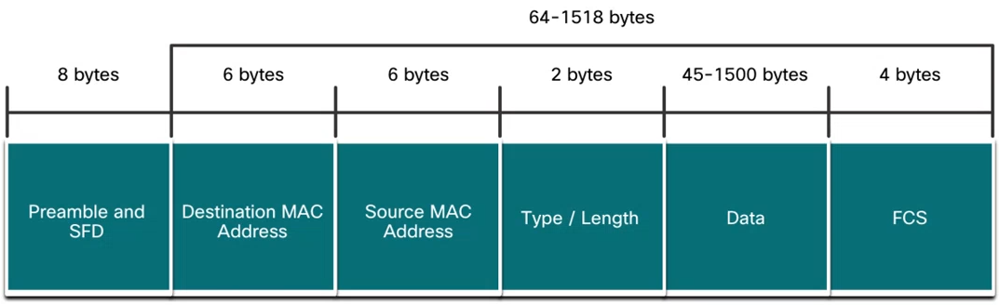
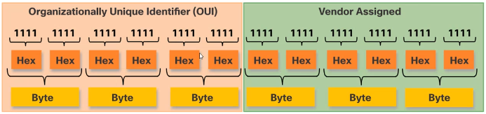
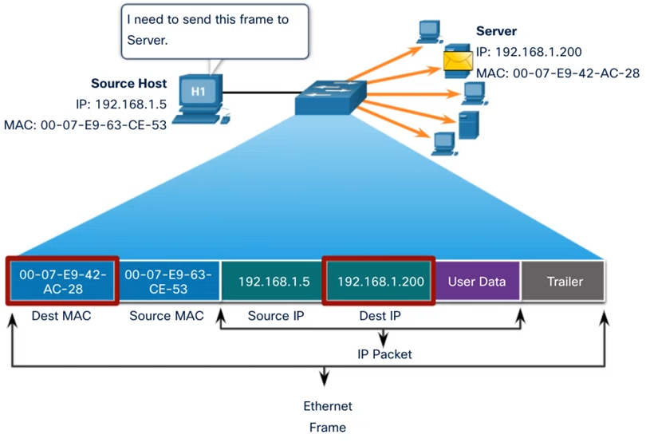
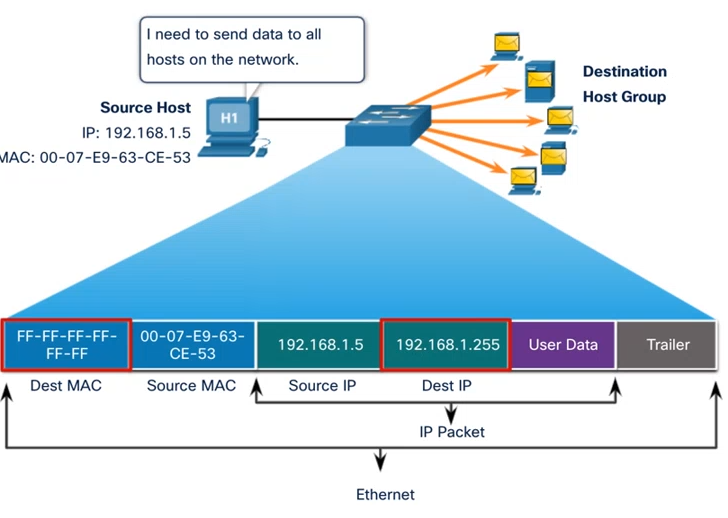
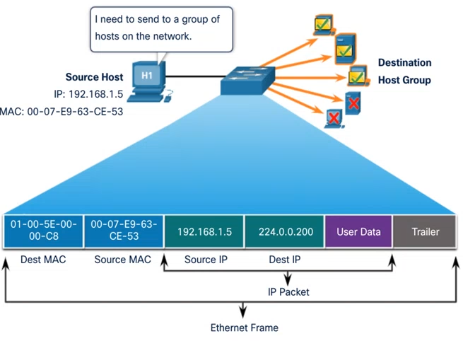
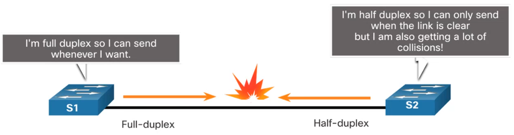

# Module 7: Ethernet Switching <!-- omit in toc -->

[Return to overview](../README.md)

---

- [Ethernet Frame](#ethernet-frame)
  - [Data Link Sublayers](#data-link-sublayers)
  - [MAC Sublayer](#mac-sublayer)
  - [Ethernet Frame Fields](#ethernet-frame-fields)
- [Ethernet MAC Address](#ethernet-mac-address)
  - [Frame Processing](#frame-processing)
  - [Unicast MAC Address](#unicast-mac-address)
  - [Broadcast MAC Address](#broadcast-mac-address)
  - [Multicast MAC Address](#multicast-mac-address)
- [The MAC Address Table](#the-mac-address-table)
  - [Switch Fundamentals Learning and Forwarding Process](#switch-fundamentals-learning-and-forwarding-process)
- [Switch Speeds and Forwarding Methods](#switch-speeds-and-forwarding-methods)
  - [Memory Buffering on Switches](#memory-buffering-on-switches)
  - [Duplex and Speed Settings](#duplex-and-speed-settings)
  - [Auto-MDIX](#auto-mdix)

---

## Ethernet Frame

<u>Explain how the Ethernet sublayer are related to the frame fields.</u>

Ethernet operates in the data link layer and the physical layer. It is a family of networking technologies defined in the **IEEE 802.2 and 802.3** standards.

### Data Link Sublayers

The 802 LAN/MAN standards, including Ethernet, use two separate sublayers of the data link layer to operate:

- **LLC Sublayer:** (IEEE 802.2) Places information in the frame to identify which network layer protocol is used for the frame
- **MAC Sublayer:** (IEEE 802.3, 802.11 or 802.15) Responsible for data encapsulation and media access control, and provides data link layer addressing.

### MAC Sublayer

The MAC sublayer is responsible for data encapsulation and accessing the media.

**IEEE 802.3** data encapsulation includes the following:

1. **Ethernet frame:** This is the internal structure of the Ethernet frame.
2. **Ethernet Addressing:** The Ethernet frame includes both a source and destination MAC address to deliver the Ethernet frame from Ethernet NIC to Ethernet NIC on the same LAN.
3. **Ethernet Error detection:** The Ethernet frame includes a frame check sequence (FCS) trailer used for error detection.

**Media Access:**

- IEEE 802.3u: Fast Ethernet
- IEEE 802.3z: Gigabit Ethernet over Fiber
- IEEE 802.3ab: Gigabit Ethernet over Copper
- IEEE 802.3ae: 10 Gigabit Ethernet over Fiber

Ethernet LANs of today use switches that operate in **full-duplex**. 
Full-duplex communications with Ethernet switches do not require access control through CSMA/CD. (See module 6 for more information)

### Ethernet Frame Fields

The minimum Ethernet frame size is 64 bytes and the maximum is 1518 bytes. Any frame less than 64 bytes is considered a **"collision fragment" or "runt frame"** and is automatically discarded. Frames with more than 1500 bytes of data are considered **"jumbo" or "baby giant frames"**.

If the size of a transmitted frame is less than the minimum, or greater than the maximum, the receiving device drops the frame. Dropped frames are likely to be the result of collisions or other unwanted signals. They are considered invalid. Jumbo frames are usually supported by most Fast Ethernet and Gigabit Ethernet switches and NICs.



---

## Ethernet MAC Address

<u>Describe the Ethernet MAC address</u>

An Ethernet MAC address consists of a 48-bit binary value, expressed using 12 hexadecimal values. **Binary 0000 0000 to 1111 1111** can be represented as the range in **hexadecimal 00 to FF**. Binary 0000 1010 is represented in hexadecimal as 0A **, and not just A!**



### Frame Processing

When a NIC receives an Ethernet frame, it examines the destination MAC address to see if t matches the physical MAC address that is stored in RAM. If there is not match, the device discards the frame. If there is a match, it passes the frame up to the **OSI layers**, where the de-encapsulation process takes place.

### Unicast MAC Address

The source MAC address must always be a unicast.


### Broadcast MAC Address

The Destination MAC and the Destination IP are here different than Unicast MAC Address.


### Multicast MAC Address

An Ethernet multicast frame is received and processed by a group of devices that belong to the same multicast group. IP addresses starting with 224, these are reserved for that reason. As with the unicast and broadcast addresses, the multicast IP address requires a corresponding multicast MAC address.


---

## The MAC Address Table

<u>Explain how a switch builds its MAC address table and forwards frames.</u>

### Switch Fundamentals Learning and Forwarding Process

A switch receives a message, In this message there is a **Destination MAC Address** and a **Source MAC Address**. The Switch will save the Source MAC Address and its associated port number to its MAC Address Table (If it isn't already stored there). And if the Destination MAC Address is not recognized it will use **Broadcasting** to forward the message to all connected devices.

If a message is sent from an unknown MAC, this address will be saved to the Switch's MAC Address Table together with its associated port number. The address will than be sent to the destination MAC Address. If this Destination MAC Address is **already in the MAC Address Table** the Switch can use **Unicast** to send the message.

Storing MAC Addresses and there associated Ports to the MAC Address Table is called the **Learning process**.

---

## Switch Speeds and Forwarding Methods

<u>Describe switch forwarding methods and port settings available on Layer 2 witch ports.</u>

Switches use one of the following forwarding methods for switching data between network ports:

- **Store-and-forward switching:** Receives the entire frame and computes the CRC (Cyclic redundancy check). If the CRC is valid, the switch looks up the destination address, which determines the outgoing interface. Then the frame is forwarded out of the correct port.
  - Advantage: It determines if a frame has errors before propagating the frame, if there is an error, the message is discarded and less bandwidth is used.
- **Cut-through switching:** Forwards the frame before it is entirely received. At a minimum, the destination address of the frame must be read before the frame can be forwarded.
  - Advantage: Speed

Store-and-Forward is required for quality of service (QoS) analysis on converged networks where frame classification for traffic prioritization is necessary. For example, voice over IP (VoIP) data streams neat to have priority over web-browsing traffic.

In cut-through switching, the switch acts upon the data as soon as it is received, even if the transmission is not complete. The switch buffers just enough of the frame to read the destination MAC address.

There are two variants of cut-through switching:

- **Fast-forward switching:** Offers the lowest level of latency by immediately forwarding a packet after reading the destination address. This is the typical cut-through method of switching.
- **Fragment-free switching:** A compromise between the high latency and high integrity of store-and-forward switching and low latency and reduced integrity of fast-forward switching. An error check is performed on the first 64 bytes of the frame before forwarding. (most network errors and collisions occur during the first 64 bytes)

### Memory Buffering on Switches

An Ethernet switch may use a buffering technique to store frames before forwarding them or when the destination port is busy because of congestion.

- **Port-based memory:**
  - Frames are stored in queues that are linked to specific incoming and outgoing ports.
  - The frame is transmitted only when all the frames ahead in the queue have been transmitted.
  - Therefor it is possible that one frame holds up the transmission because of a busy destination port.
- **Shared memory:**
  - Deposits all frames into a common memory buffer shared by all ports and the amount of memory is dynamically allocated.
  - The frames in the buffer are dynamically linked to the destination port enabling a packet to be received on one port and then transmitted on another port, without moving it to a different queue.

Shared memory buffering also results in larger frames that can be transmitted with fewer dropped frames. (important with asymmetric switching which allows for different data rates on different ports) Therefore, more bandwidth can be dedicated to certain ports.

### Duplex and Speed Settings

Two of the most basic settings on a switch are the bandwidth and duplex settings for each individual switch port. It is critical that the duplex and bandwidth settings match between the switch port and the connected devices.

Auto negotiation is an optional function found on most Ethernet switches and NICs. It enables two devices to automatically negotiate the best speed and duplex capabilities.

Gigabit Ethernet ports only operate in full-duplex



In this illustration S1 will have to adjust its duplex software settings for the port that is connected with S2. The network is only as fast is its weakest link.

### Auto-MDIX

Most switch devices now support the **automatic medium-dependent interface crossover (auto-MDIX) feature**. When enabled, the switch automatically detects the type of cable attached to the port and configures the interfaces accordingly.

```batch
Switch(conf-if)# mdix auto
```

This feature is not required when **cross-over is used between identical devices** and **straight-thru between host and network device**
