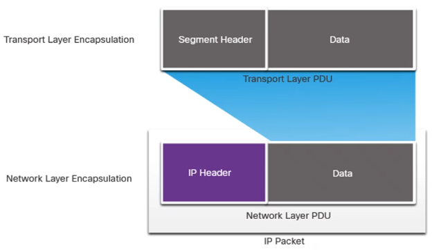
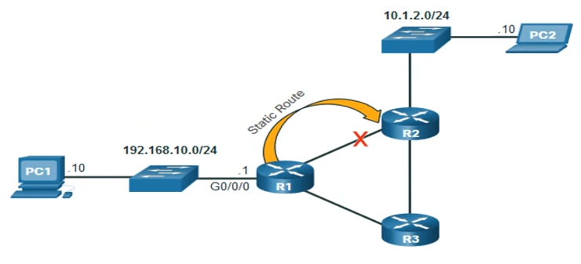
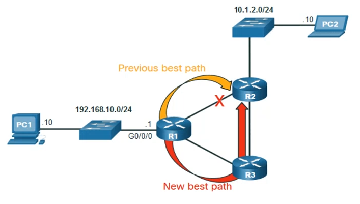

# Module 8: Network Layer <!-- omit in toc -->

[Return to overview](../README.md)

---

- [Network Layer Characteristics](#network-layer-characteristics)
  - [IP Encapsulation](#ip-encapsulation)
- [IPv4 Packet](#ipv4-packet)
  - [The IPv4 Packet Header Fields](#the-ipv4-packet-header-fields)
- [IPv6 Packet](#ipv6-packet)
- [How a Host Routes](#how-a-host-routes)
  - [Host forwarding Decision](#host-forwarding-decision)
  - [Default Gateway](#default-gateway)
  - [A Host Routes to the Default Gateway](#a-host-routes-to-the-default-gateway)
- [Introduction to Routing](#introduction-to-routing)
  - [IP Router Routing Tables](#ip-router-routing-tables)
  - [Static Routing](#static-routing)
  - [Dynamic Routing](#dynamic-routing)
  - [Introduction to an IPv4 Routing Table](#introduction-to-an-ipv4-routing-table)

---

## Network Layer Characteristics

<u>Explain how the network layer uses IP protocols for reliable communications.</u>

### IP Encapsulation

IP encapsulates the transport layer segment. 

NAT will change addressing this is used to change private IP addresses to public IP addresses.

IP is meant to have low overhead and may be described as:

**Connectionless:**

- There is no control information needed. IP does not establish a connection with the destination on the Network Layer before sending the packet. Because this check will happen on the Transport Layer.
- If this connection is required TCP will be used.

**Best Effort:**

- The Routers will always choose the best path possible.
- Overhead is reduced since there is nothing to resend if not received. (packets could be lost in this case)

**Media Independent:**

- IP is unreliable:
  - It cannot manage or fix undelivered or corrupt packets.
  - IP cannot retransmit after an error or realign out of sequence packets.
  - IP must rely on other protocols for these functions

- IP is media Independent:
  - IP does not concern itself with the type of frame required at the data link layer or the media type at the physical layer.
- The Network layer will establish the **Maximum Transmission Unit (MTU)**
  - Depending which Media Layer is used; the MDU will be limited, even the NIC can have influence on the MUD.
  - This will cause fragmentation

---

## IPv4 Packet

<u>Explain the role of the major header fields in the IPv4 packet.</u>

### The IPv4 Packet Header Fields

Minimal Header length is 20 bytes for IPv4.

**Significant fields in the IPv4 header:**

| Function | Description |
| --- | --- |
| Destination IPv4 Address | 32 bit destination address |
| Source IPv4 Address | 32 bit source address |
| Version | For v4 (opposed to v6), a `4 bit field = 0100` |
| Differentiated Services | Used for QoS - DS field / (older) IntServ - ToS or (Type of Service) |
| Header Checksum | Detect corruption in the IPv4 header (only header!) |
| Time to Live (TTL) | Counter for Layer 3 hops, when it is 0, packet discard |
| Protocol | I.D.s next level protocol for Transport Layer: (ICMP for `ping`, TCP UDP, etc.) |

---

## IPv6 Packet

<u>Explain the role of the major header fields in the IPv6 packet.</u>

**Improvements that IPv6 provides:**

- Increased address space
- Improved packet handling - simplified header with fewer fields
- Eliminates the need for NAT - since there is a huge amount of addressing, there is no need to use private addressing internally and be mapped to a shared public address (10^36 addresses)

The header is fixed at 40 Bytes or octets long.

**Significant fields in the IPv6 header:**

Several IPv4 fields were removed to improve performance.

| Function | Description |
| --- | --- |
| Destination IPv6 Address | 128 bit destination address |
| Source IPv6 Address | 128 bit source address |
| Version | v6, a `4 bit field = 0110` |=
| Hop Limit | Counter for Layer 3 hops, when it is 0, packet discard |
| Traffic Class | Used for QoS - DS field |
| Flow Label | Informs device to handle identical flow labs the same way, 20 bit field |
| Payload Length | 16-bit filed that indicates the length of the data portion in the IPv6 packet |
| Next Header | I.D.s next level protocol: ICMP `ping`, TCP, UDP, etc.|

**Where IPv4 and IPv6 are the same:**

- Version
- Source IP
- Destination
- Same fields different name:
  - Hop Limit = TTL
  - Next Header = Protocol

**Differences between IPv4 and IPv6:**

- IPv6 has no need for Header Checksum
- IPv6 has Payload Length which indicates the length of the data  portion in the IPv6 packet
- IPv6 also has optional extension headers (not important in this course)

---

## How a Host Routes

<u>Explain how network devices use routing tables to direct packets to a destination network.</u>

Each host device creates their own routing table. A host can send packets to the following:

- itself - 127.0.0.1 (IPv4), ::1 (IPv6)
- Local Hosts - destination is on the same LAN
- Remote Hosts - not on same LAN

In 192.168.10.0/24 the 24 stands for the amount of network bits. This means that 192.168.10 (1100 0000.1010 1000.0000 1010) are the network bits. And only the final 8 bits identify the host. The first address (192.168.10.0) is the network address, and the last (192.168.10.255) is the broadcast address.

**If /24 than subnet mask is: 255.255.255.0**

### Host forwarding Decision

The source device determines whether the destination is local or remote.

Method of determination:

- **IPv4:** Source uses:
  - source IP address
  - Subnet mask
  - destination IP address
- **IPv6** Source uses:
  - The network address
  - prefix advertised by the local router

**Local traffic** is dumped out to the host interface to be handled by an intermediary device.
**Remote traffic** is forwarded directly to the default gateway on the LAN.

### Default Gateway

A router or layer 3 switch can be a default-gateway.

**Features of a default gateway (DGW):**

- IP address must be in the same range as the rest of the LAN
- Can accept data from the LAN and capable of forwarding traffic of the LAN
- Can route to other networks

If a device has no default gateway or a bad default gateway, its traffic will not be able to leave the LAN.

### A Host Routes to the Default Gateway

- The host will know the default gateway (DGW) either statically or through DHCP in IPv4.
- IPv6 sends the DGW through a router solicitation (RS) or can be configured manually.
- A DGW is static route which will be a last resort route in the routing table.
- All device on the LAN will need the DGW of the router if they intend to send traffic remotely.

---

## Introduction to Routing

### IP Router Routing Tables

<u>Explain the function of fields in the routing table of a router.</u>

Show IP table windows `netstat -r`
Show IP table on Cisco router `show ip route`

There are three types of routes in a routes's routing table:

- **Directly Connected:** Routes that are automatically added by the router, provided the interface is active and has addressing.
- **Remote:** The routes that the router does not have a direct connection with and may be learned:
  - Manually with static route
  - Dynamically by using a routing protocol
- **Default Route:** Forwards all traffic to a specific direction, when there is not a match in the routing table.

### Static Routing

Static Route Characteristics:

- Must be configured manually
- If change in topology must be manually reconfigured
- Good for small **non-redemand** networks
- Often used in conjunction with a dynamic routing protocol for configuring a default route.

### Dynamic Routing

Dynamic Routes Automatically:

- Discover remote networks
- Maintain up-to-date information
- Choose **the best path** to the destination
- Find **new best paths** when there is a topology change

### Introduction to an IPv4 Routing Table

**The `show ip route` command shows the following route sources:**

- **L** - Directly connected local interface IP address
- **C** - Directly connected network
- **S** - Static route was manually configured by an administrator
- **O** - OSPF
- **D** - EIGRP (Dynamic but not important in this course)

**The `show ip route` command also shows types of routes**

- **Directly Connected:** C and L
- **Remote Routes:** O, D, etc.
- **Default Routes:** S*
